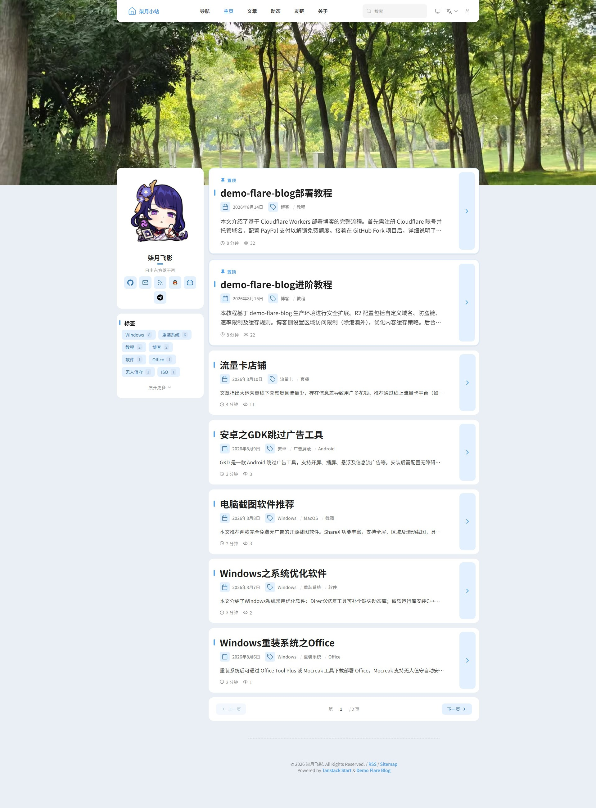
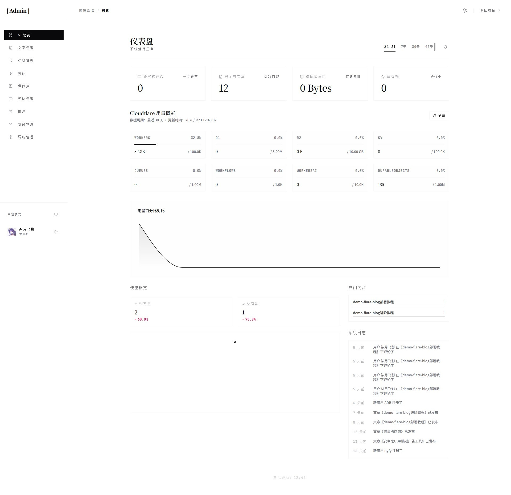

中文 | [English](./docs/README.en.md)

# demo-flare-blog

基于 **Cloudflare Workers** 的全栈现代化博客<br>
深度集成 D1、R2、KV、Workflows 等 Serverless 服务，开箱即用、可 Fork 部署

[](https://react.dev)
[](https://tanstack.com/start)
[](https://tailwindcss.com)
[](./LICENSE)

[在线演示](https://blog.qyfy.kdns.fr) · [功能](#核心功能) · [技术栈](#技术栈) · [部署流程](#部署流程) · [环境变量参考](#环境变量参考) · [本地开发](#本地开发) · [常见问题](#常见问题)

---

> **注意**：本项目专为 Cloudflare 生态设计，**仅支持**部署在 Cloudflare Workers。

> 建了个 Telegram 群组，欢迎交流本项目相关问题：[Telegram 群](https://t.me/+Rmtf2Jmx_MUwNWE1)

> **项目来源**：本项目基于 [flare-stack-blog](https://github.com/du2333/flare-stack-blog)（v1.5.2）改造而来，保留 GPL-3.0 协议；部分功能参考 [Rin](https://github.com/openRin/Rin)。部署与日常使用见下文。

## 界面预览




## 核心功能

- **文章管理** — 富文本编辑器（代码高亮 / 表格 / 数学公式 / 目录），图片上传，草稿 / 发布 / 定时发布流程，自动保存
- **版本历史** — 编辑器自动快照与文章版本回溯，误改可一键恢复
- **标签系统** — 灵活的文章归类
- **评论系统** — 嵌套回复、邮件通知、AI 辅助审核与上下文化审核，违规评论自动拦截并通知管理员；文章与动态评论统一存储在评论区，同一套体系管理与审核
- **动态（Moments）** — 富文本（TipTap）分享即时内容，支持图片图床上传，点赞、评论与删除，评论区与文章共用一套评论系统
- **关于页** — 通过后台创建 slug 为 `about` 的文章即可填充；未创建时展示空状态与管理员创建入口
- **友情链接** — 访客申请、后台审核、邮件通知
- **通知系统** — 邮件 + Webhook 多通道通知，可按事件订阅
- **全文搜索** — 基于 Orama 的高性能站内搜索
- **媒体库** — R2 对象存储，图片上传与优化
- **第三方图床** — 后台设置 → 图床可启用 ImgBB / 幻域图床（ffsky）：文章图片走后端服务端代理上传（key 不下发浏览器、绕开无 CORS 限制），评论区使用 ImgBB 官方上传弹窗；未启用或未配置 Key 时回退到 R2，图床启用后自动关闭 R2 上传入口
- **用户认证** — GitHub OAuth + 邮箱密码注册/登录，`ADMIN_EMAIL` 自动授予管理员
- **MCP Server** — 通过 OAuth 连接 AI 客户端（Claude / Cursor 等），管理文章、评论、标签、友链、媒体与统计
- **数据统计** — 站内浏览量统计（Queue + D1）+ Umami 可选集成
- **SEO 增强** — Canonical URL、Schema.org 结构化数据、RSS / Sitemap / Robots.txt
- **AI 辅助** — 支持 Cloudflare Workers AI、Agnes AI（无限期免费，国际站/国内站双端点）或任意 OpenAI 兼容接口（可自选 Base URL / 模型 / API Key），提供文章摘要、评论审核、标签推荐与 AI 一键生文
- **主题系统** — 可扩展主题契约，完整替换页面与布局（内置 `default` / `fuwari` 两套主题）
- **导入导出** — Markdown 导入/导出，保留图片与 Frontmatter

## 技术栈

### Cloudflare 生态

| 服务            | 用途                           |
| :-------------- | :----------------------------- |
| Workers         | 边缘计算与托管                 |
| D1              | SQLite 数据库                  |
| R2              | 对象存储（媒体文件）           |
| KV              | 缓存层                         |
| Durable Objects | 分布式限流 / 密码哈希          |
| Workflows       | 异步任务（内容审核、定时发布） |
| Queues          | 消息队列（邮件通知）           |
| Workers AI      | AI 能力（或接入 Agnes AI / OpenAI 兼容接口） |
| Images          | 图片优化（可选）               |

### 前端

- **框架**：React 19 + TanStack Router / Query / Start
- **样式**：TailwindCSS 4
- **表单**：React Hook Form + Zod
- **图表**：Recharts

### 后端

- **网关层**：Hono（认证路由、媒体服务、缓存控制）
- **业务层**：TanStack Start（SSR、Server Functions）
- **数据库**：Drizzle ORM + drizzle-zod
- **认证**：Better Auth（GitHub OAuth + 邮箱密码）
- **国际化**：Paraglide（inlang），文案 zh / en 双语

### 编辑器

TipTap 富文本 + Shiki 代码高亮

### 目录结构

```
src/
├── features/
│   ├── posts/                  # 文章管理（其他模块结构类似）
│   │   ├── api/                # Server Functions（对外接口）
│   │   ├── data/               # 数据访问层（Drizzle 查询）
│   │   ├── posts.service.ts    # 业务逻辑
│   │   ├── posts.schema.ts     # Zod Schema + 缓存 Key 工厂
│   │   ├── components/         # 功能专属组件
│   │   ├── queries/            # TanStack Query Hooks
│   │   └── workflows/          # Cloudflare Workflows
│   ├── comments/    # 评论、嵌套回复、审核
│   ├── moments/     # 动态（TipTap 编辑器、图床上传）
│   ├── tags/        # 标签管理
│   ├── media/       # 媒体上传、R2 存储
│   ├── search/      # Orama 全文搜索
│   ├── auth/        # 认证、权限控制
│   ├── dashboard/   # 管理后台数据统计
│   ├── email/       # 邮件通知（SMTP）
│   ├── cache/       # KV 缓存服务
│   ├── config/      # 博客配置
│   ├── friend-links/# 友情链接（申请、审核）
│   ├── import-export/# Markdown 导入导出
│   ├── version/     # 版本更新检查
│   ├── theme/       # 主题系统（契约、注册表、各主题实现）
│   └── ai/          # AI 集成（Workers AI / Agnes AI / OpenAI 兼容接口）
├── routes/
│   ├── _public/     # 公开页面（首页、文章列表/详情、搜索、友链、动态、关于）
│   ├── _auth/       # 登录/注册/找回密码
│   ├── _user/       # 个人中心、友链申请
│   ├── admin/       # 管理后台（仪表盘、文章、评论、媒体、标签、友链、设置）
│   ├── rss[.]xml.ts     # RSS Feed
│   ├── sitemap[.]xml.ts # Sitemap
│   └── robots[.]txt.ts  # Robots.txt
├── components/      # UI 组件（ui/, common/, layout/, tiptap-editor/）
├── lib/             # 基础设施（db/, auth/, hono/, middlewares）
└── hooks/           # 自定义 Hooks
```

---

## 部署流程

下面是从 **Fork 仓库** 到 **正式上线** 的完整流程。推荐使用 **GitHub Actions** 自动化部署（步骤 0–6）；也可以选择 Cloudflare Dashboard 手动部署（见 [方案二](#方案二-cloudflare-dashboard-手动部署)）。

### 阶段 0：Fork 仓库

1. 打开本仓库，点击右上角 **Fork**，克隆到你自己的 GitHub 账号下（只有 Fork 后才有权限配置 Secrets 并触发自动化部署）。
2. Fork 完成后，进入你的仓库 **Actions** 标签页，点击 **Enable workflows**（GitHub 默认对 Fork 仓库关闭 Actions）。

### 阶段 1：Cloudflare 准备工作

1. **注册 Cloudflare 账号**：[dash.cloudflare.com/sign-up](https://dash.cloudflare.com/sign-up)。R2 与 Workers AI 需要绑定支付方式（个人博客一般免费额度内完全够用）。
2. **域名 DNS 托管到 Cloudflare**：把博客要用的域名添加为 Cloudflare Zone 并把 Nameserver 指过去。若不想托管 DNS，可直接使用 `*.workers.dev` 域名上线（见 [阶段 4](#阶段-4选择域名绑定模式)）。
3. **创建资源**（在 Dashboard 中逐个创建并记录名称 / ID）：
   - **R2 Bucket** — 存储图片与静态资源（记录 Bucket 名称）
   - **D1 Database** — 存储文章与配置（记录 Database ID）
   - **KV Namespace** — 缓存（记录 Namespace ID；`KV` 与 `OAUTH_KV` 两个绑定共用同一个）
   - **Queue** — 创建名为 `blog-queue` 的队列
4. **获取凭证**：
   - **Account ID**、**Zone ID**：域名概览页右侧可见
   - **部署 API Token**：右上角头像 → My Profile → API Tokens → Create Token，选 **Edit Cloudflare Workers** 模板，再额外添加 **D1 → Edit** 权限，Resource 选你的账号/域名
   - **Purge API Token**（可选）：选 **Edit zone DNS** 模板，加 **Zone → Cache Purge → Purge** 权限，仅当你需要部署后自动清理 CDN 缓存时配置

### 阶段 2：创建 GitHub OAuth App

1. 打开 [GitHub Developer Settings](https://github.com/settings/developers) → **OAuth Apps** → **New OAuth App**。
2. 填写（以最终域名 `https://blog.example.com` 为例）：
   - **Homepage URL**：`https://blog.example.com`
   - **Authorization callback URL**：`https://blog.example.com/api/auth/callback/github`
3. 记录 **Client ID**，并生成一份 **Client Secret**。

> 纯 workers.dev 部署时，把上面两处替换为你的 `https://<worker>.workers.dev`。

### 阶段 3：配置 GitHub Secrets 与 Variables

进入你的仓库 **Settings → Secrets and variables → Actions**，按下表配置。

**A. 必填 Secrets（CI/CD 资源）**

| 变量名 | 说明 |
| :--- | :--- |
| `CLOUDFLARE_API_TOKEN` | 阶段 1 的部署 Token |
| `CLOUDFLARE_ACCOUNT_ID` | Cloudflare Account ID |
| `D1_DATABASE_ID` | D1 数据库 ID |
| `KV_NAMESPACE_ID` | KV 命名空间 ID |
| `BUCKET_NAME` | R2 Bucket 名称 |

**B. 必填 Secrets（运行时）**

| 变量名 | 说明 |
| :--- | :--- |
| `BETTER_AUTH_SECRET` | 会话加密密钥，`openssl rand -hex 32` 生成 |
| `BETTER_AUTH_URL` | 应用 URL，如 `https://blog.example.com` |
| `ADMIN_EMAIL` | 管理员邮箱（注册该邮箱即成为管理员） |
| `GH_CLIENT_ID` | GitHub OAuth Client ID |
| `GH_CLIENT_SECRET` | GitHub OAuth Client Secret |
| `DOMAIN` | 博客域名，如 `blog.example.com`；纯 workers.dev 部署时填你的 `xxx.workers.dev` |

**C. 可选 Secrets（运行时）**

| 变量名 | 说明 |
| :--- | :--- |
| `CLOUDFLARE_ZONE_ID` | Zone ID，仅需要部署后自动 Purge CDN 时填写 |
| `CLOUDFLARE_PURGE_API_TOKEN` | Purge Token，同上（可选） |
| `CDN_DOMAIN` | 独立 CDN 域名，purge 时优先使用 |
| `GH_TOKEN` | GitHub API Token，用于版本更新检查；建议创建 [Fine-grained PAT](https://github.com/settings/personal-access-tokens/new) 避免限流 |
| `PAGEVIEW_SALT` | 浏览量匿名化 salt，`openssl rand -hex 16` 生成 |
| `TURNSTILE_SECRET_KEY` | Cloudflare Turnstile Secret Key |
| `UMAMI_SRC` | Umami 埋点代理 URL |
| `LOCALE` | 默认语言 `zh` / `en`，默认 `zh` |

**D. Variables（构建时 / CI/CD）** —— 这些放 **Variables** 标签页

| 变量名 | 说明 |
| :--- | :--- |
| `THEME` | 主题名，默认 `default`，可填 `fuwari` |
| `VITE_UMAMI_WEBSITE_ID` | Umami Website ID |
| `VITE_TURNSTILE_SITE_KEY` | Turnstile Site Key |
| `ROUTE` | 设为 `custom_domain` 时改用官方 custom_domain 模式；缺省为 routes 模式 |
| `CUSTOM_DOMAIN` | 设为 `1` 同样切换到 custom_domain 模式 |
| `ZONE_NAME` | 可选，routes 模式下 Zone 与 `DOMAIN` 推导结果不一致时覆盖 |

### 阶段 4：选择域名绑定模式

部署脚本（`bun run wrangler:prepare`）会根据以下规则自动生成 `wrangler.jsonc` 的 `routes`：

| 模式 | 触发条件 | 生成的 routes | 适用场景 |
| :--- | :--- | :--- | :--- |
| **routes（默认，推荐）** | 不设置任何开关 | `[{ pattern: "blog.example.com/*", zone_name: "example.com" }]` | 域名 Zone 已在 Cloudflare 账号内 |
| **custom_domain** | `ROUTE=custom_domain` 或 `CUSTOM_DOMAIN=1` | `[{ pattern: "blog.example.com", custom_domain: true }]` | 已在 Dashboard 中把域名绑定为 Worker 自定义域 |
| **纯 workers.dev** | `DOMAIN` 为空或以 `.workers.dev` 结尾 | `routes: []` | 不绑定自定义域名，直接访问 `xxx.workers.dev` |

> routes 模式下的 `zone_name` 默认从 `DOMAIN` 自动推导（二级域名取注册域），如推导不正确可设置 `ZONE_NAME` 覆盖。例如 `DOMAIN=blog.example.com` 会推导出 `zone_name=example.com`，若你的 Cloudflare Zone 名称不是 `example.com`（如 `example.co.uk`），则必须手动设置 `ZONE_NAME`。

### 阶段 5：触发部署

1. 回到仓库 **Actions** 标签页，选择 **deploy to cloudflare workers** workflow，点击 **Run workflow**。
2. 观察流水线，它会自动依次执行：
   - 安装依赖 → 读取 Secrets → `wrangler:prepare` 生成配置文件
   - `wrangler secret bulk` 写入运行时变量
   - `bun run build` 构建前端与 SSR
   - `bun db:migrate` 安全应用 D1 迁移（校验失败自动回滚）
   - `wrangler deploy` 发布 Worker
   - （可选）Purge CDN 缓存
3. 部署成功后，**之后的每次 `push` 到 `main` 都会自动重新部署**。

### 阶段 6：上线检查清单

部署成功后按以下清单确认，即可正式对外：

- [ ] 访问你的域名，确认首页、文章页、RSS（`/rss.xml`）、Sitemap（`/sitemap.xml`）、Robots（`/robots.txt`）正常
- [ ] 打开 `/admin`，用 `ADMIN_EMAIL` 注册账号，系统自动赋予管理员权限
- [ ] 在后台 **设置** 中完善站点标题、描述、头像、favicon、社交链接、SEO 信息
- [ ] 上传一张图片验证媒体库（R2）可用
- [ ] （可选）配置第三方图床：后台设置 → 图床，启用 ImgBB（文章 + 评论）或幻域图床 ffsky（文章），填入 API Key 后点「测试连接」；文章图床启用后 R2 上传入口会自动关闭，未启用或未配置 Key 时才回退 R2
- [ ] （可选）配置 SMTP 邮件：后台设置 → 邮箱，即可使用验证码登录与评论回复通知
- [ ] （可选）配置 Webhook 通知：后台设置 → 通知，按事件订阅
- [ ] （可选）开启 Turnstile 人机验证、Umami 统计
- [ ] （可选）后台设置 → AI 配置 AI 服务：默认 Workers AI，也可切换到 **Agnes AI**（无限期免费，一键选择国际站/国内站端点）或 OpenAI 兼容接口（填写 Base URL / 模型 / API Key 后点「测试连接」）
- [ ] 若页面样式异常，在后台设置页手动 **清除 CDN 缓存** 或到 Cloudflare Dashboard 清理

### 方案二：Cloudflare Dashboard 手动部署

如果你不使用 GitHub Actions，也可以让 Cloudflare 直接连仓库构建：

1. 复制 `wrangler.example.jsonc` 为 `wrangler.jsonc`，填入 D1 / R2 / KV 的 ID 与名称，并按 [阶段 4](#阶段-4选择域名绑定模式) 配置 `routes` 后提交到仓库。
2. Cloudflare Dashboard → Workers & Pages → **Create application → Pages → Connect to Git**，选择你的仓库。
3. 构建配置：**Framework preset** 选 `None`，**Build command** 填 `bun run build`，**Deploy command** 填 `bun run deploy`；构建变量里加 `BUN_VERSION=1.3.5`。
4. 首次部署完成后，在 Worker **Settings → Variables and Secrets** 中添加运行时变量（名称用完整运行时名，如 `GITHUB_CLIENT_ID`、`GITHUB_CLIENT_SECRET`、`GITHUB_TOKEN`，无需 `GH_` 前缀）。
5. 此方式没有自动 CDN Purge，每次发布后需手动清缓存。

---

## 环境变量参考

| 文件 | 用途 |
| :---------- | :------------------------------------- |
| `.env`      | 客户端变量（`VITE_*`），Vite 构建时读取 |
| `.dev.vars` | 服务端变量，Wrangler 注入 Worker `env`（本地开发） |

部署用变量清单见 [阶段 3](#阶段-3配置-github-secrets-与-variables)。完整定义见 `src/lib/env/server.env.ts`。

---

## 本地开发

### 前置要求

- [Bun](https://bun.sh) >= 1.3
- Cloudflare 账号（用于远程 D1 / R2 / KV 资源）

### 快速开始

```bash
# 安装依赖
bun install

# 配置环境变量
cp .env.example .env            # 客户端变量
cp .dev.vars.example .dev.vars  # 服务端变量

# 生成 wrangler.jsonc（填入真实资源 ID）
bun run wrangler:prepare

# 启动开发服务器（默认端口 3000）
bun dev
```

### 登录管理后台

**方式一：邮箱密码注册（无需第三方服务）**

1. 访问 `http://localhost:3000` 注册页面，使用 `.dev.vars` 中配置的 `ADMIN_EMAIL` 注册账号
2. 开发环境下验证邮件不会真正发送，验证链接会打印到控制台，复制访问即可完成验证
3. 验证后自动登录，系统根据 `ADMIN_EMAIL` 自动赋予管理员权限

**方式二：GitHub OAuth**

1. 前往 [GitHub Developer Settings](https://github.com/settings/developers) 创建 OAuth App
2. Homepage URL 填 `http://localhost:3000`，Authorization callback URL 填 `http://localhost:3000/api/auth/callback/github`
3. 将 Client ID 和 Client Secret 填入 `.dev.vars`

### 常用命令

| 命令            | 说明                        |
| :-------------- | :-------------------------- |
| `bun dev`       | 启动开发服务器（端口 3000） |
| `bun run build` | 构建生产版本                |
| `bun run test`  | 运行测试                    |
| `bun run lint`  | Biome Lint 检查             |
| `bun run typecheck` | TypeScript 类型检查      |
| `bun run check` | 类型检查 + Lint + 格式化    |
| `bun run i18n:verify` | 校验 zh / en 双语文案完整性 |

### 数据库命令

| 命令              | 说明                                |
| :---------------- | :---------------------------------- |
| `bun db:studio`   | 启动 Drizzle Studio（可视化数据库） |
| `bun db:generate` | 生成迁移文件                        |
| `bun db:migrate`  | 安全应用远程 D1 迁移，校验失败自动回滚 |
| `bun db:migrate:local` | 安全应用本地 D1 迁移，校验失败自动恢复 |
| `bun db:migrate:unsafe` | 直接应用远程 D1 迁移，不做校验 |

> `bun db:migrate` 会复用 schema 中的状态常量，迁移前后校验 `posts`、`comments` 的关键计数；远程模式默认记录 D1 Time Travel bookmark，校验失败自动 restore。

### 本地模拟 Cloudflare 资源

默认配置使用远程 D1 / R2 / KV 资源。如需完全本地开发，在 `wrangler.jsonc` 中移除对应 `remote: true`，Miniflare 会自动模拟：

```jsonc
{
  "d1_databases": [{ "binding": "DB", ... }],  // 移除 "remote": true
  "r2_buckets": [{ "binding": "R2", ... }],    // 移除 "remote": true
  "kv_namespaces": [{ "binding": "KV", ... }]  // 移除 "remote": true
}
```

> 本地模拟数据不会同步到远程，本地数据库迁移推荐 `bun db:migrate:local`。

---

## 维护与更新

### 检查版本更新

后台「设置 → 维护」中点击「检查更新」，会请求本项目源仓库 [cxyqiyue/demo-flare-blog](https://github.com/cxyqiyue/demo-flare-blog) 的 GitHub Release，与当前部署版本比较；检测到新版本时，提示条上的「查看」按钮会跳转到对应 Release 页面。

### 同步更新你的 Fork

本项目更新检测的目标是源仓库（非你的 Fork），提示不会直接改动你的仓库。有新版本时按如下步骤手动同步，你的 Fork 的 Actions 会自动重新部署：

1. 打开你 Fork 仓库首页，点击 **Sync fork → Update branch**。
2. 你的仓库 Actions 会自动检测到更新并重新部署（若配置了 Dashboard 构建则自动触发）。
3. 本项目的个性化配置全部通过环境变量 / 后台设置维护，直接同步上游代码通常不会产生冲突。

> 本项目为自定义改造版本，建议在升级前先阅读更新日志，确认新功能与自定义改动兼容。

---

## 常见问题

### 1. 部署成功但网页打不开 / 报 500？

- **看控制台**：F12 → Console 看报错
- **看实时日志**：Cloudflare Dashboard → 你的 Worker → Observability → Live，报错通常会直接指出缺失或错误的变量
- **检查环境变量**：绝大多数"打不开"都是环境变量配置错误，对照 [阶段 3](#阶段-3配置-github-secrets-与-variables) 逐项核对

### 2. 构建时与运行时变量有什么区别？

- **构建时变量**（`THEME`、`VITE_*`）：打进构建产物，改错必须重新构建/部署才生效
- **运行时变量**：服务端运行时读取（如 `BETTER_AUTH_SECRET`、`DOMAIN`）
- GitHub Actions 方案把所有变量都放进 Secrets/Variables 由流水线分发；Dashboard 方案则分别放在 Build Variables 和 Variables and Secrets

### 3. 我的域名 DNS 不在 Cloudflare，能用吗？

可以。把 `DOMAIN` 设为你的 `xxx.workers.dev`，部署脚本会自动生成空 `routes`，直接访问 workers.dev 地址上线；或先把域名加入 Cloudflare Zone 再使用 routes 模式。

### 4. 发布了文章但前台看不到？

发布按钮只有在状态为 **Published** 且发布时间早于当前时间时才会真正发布；若发布时间在未来，则会在那个时间点由后台任务自动发布。

### 5. 如何下架已发布文章？

把状态从 **Published** 改为 **Draft**，发布按钮会变为下架按钮。

### 6. 后台样式异常 / 发布后前台不更新？

先确认 `CLOUDFLARE_ZONE_ID` / `CLOUDFLARE_PURGE_API_TOKEN` 是否配置（未配置则部署后不会自动 Purge），然后在后台设置页手动 **清除 CDN 缓存**。

### 7. 如何接入 AI 客户端（MCP）？

本仓库内置 MCP Server，通过 OAuth 连接 AI 客户端（如 Claude、Cursor），可管理文章、评论、标签、友链、媒体与统计。访问 `/oauth/consent` 走完授权即可使用。

### 8. 如何配置第三方图床？

后台设置 → 图床，支持两家同时启用，互不冲突：

- **ImgBB**：可分别开启「评论区」与「文章区」。评论区开启后，评论编辑器点图片按钮会弹出 ImgBB 官方上传窗口（无需 API Key）；文章区开启后，文章编辑器上传图片会先走服务端代理上传到 ImgBB。在 [imgbb.com](https://imgbb.com) 登录后到账户页获取 API Key。
- **幻域图床（ffsky）**：只支持「文章区」，上传同样走服务端代理（其 API 无 CORS，不能由浏览器直接调用），默认接口 `https://pic.ffsky.net/api/1/upload` 可在设置中修改。
- **R2 回退规则**：文章图片只在「第三方图床未开启，或开启了但未配置可用的 Key」时才会回退到 R2 媒体库；只要文章区图床已启用并配置了 Key，就会只走第三方图床，即使上传失败也只报错、绝不静默写入 R2。
- **关闭 R2 上传入口**：文章区图床启用后，后台媒体库的「上传」入口（上传按钮、拖拽/粘贴上传）会自动禁用，文章编辑器图片弹窗中的 R2 媒体库选择也会隐藏，避免图片上传/插入到错误位置；已有 R2 图片仍可浏览、改名与删除。
- **多图床切换**：两家的文章上传按 ImgBB → ffsky 的顺序尝试，其中一家失败会自动尝试下一家，仅当所有已启用且填了 Key 的图床都失败时才返回错误。
- 图床 API Key 与站点其他配置（SMTP、AI Key 等）一样保存在 D1 配置表中，仅服务端读取，不会下发到浏览器。

### 8.5. 部署报错 "Could not find zone" 怎么办？

这通常是因为 `ZONE_NAME` 推导不正确。例如你使用 `blog.qyfy.kdns.fr` 作为 `DOMAIN`，脚本会自动推导出 `zone_name` 为 `kdns.fr`，但实际 Cloudflare Zone 是 `qyfy.kdns.fr`。

**解决方法**：在仓库 Settings → Secrets and variables → Actions → **Variables** 中添加：

| 变量名 | 值 |
| :--- | :--- |
| `ZONE_NAME` | 你的 Cloudflare Zone 名称（如 `qyfy.kdns.fr`） |

> 判断方法：在 Cloudflare Dashboard → 你的域名概览页，页面标题显示的就是 Zone 名称。

### 9. 如何接入 Agnes AI（国际站 / 国内站）？

Agnes AI 无限期免费，使用 OpenAI 兼容协议，后台设置 → AI 配置，选择 **Agnes AI** 后可直接点选端点：

- **国际站**：`https://apihub.agnes-ai.com/v1`（默认）；中国大陆用户网络不佳时，可改用 **国际站（国内加速）** `https://apihub.agnes-ai.cn/v1`，仍使用国际站的 API Key。
- **国内站**：`https://api.agnes-ai.cn/v1`，需要在 [agnes-ai.cn](https://agnes-ai.cn) 单独注册并获取国内站 API Key。

注意：

- 国际站与国内站 **账号 / API Key / 数据互不互通**，不能混用：国内站 Key 只能用国内端点，国际站 Key 用国际端点或国内加速端点。
- 填入端点与模型（如 `deepseek-chat` 等，以官方模型列表为准）后点击「测试连接」验证；若返回超时或 401/403，先核对 Key 与端点是否匹配。

---

## 参考项目

本项目基于 [flare-stack-blog](https://github.com/du2333/flare-stack-blog)（v1.5.2，GPL-3.0）改造而来，功能部分参考 [Rin](https://github.com/openRin/Rin)，遵循 **GPL-3.0** 协议开源，详见 [LICENSE](./LICENSE)。
